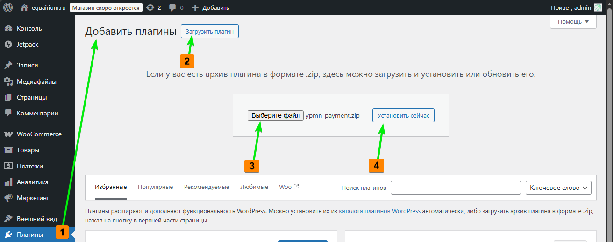
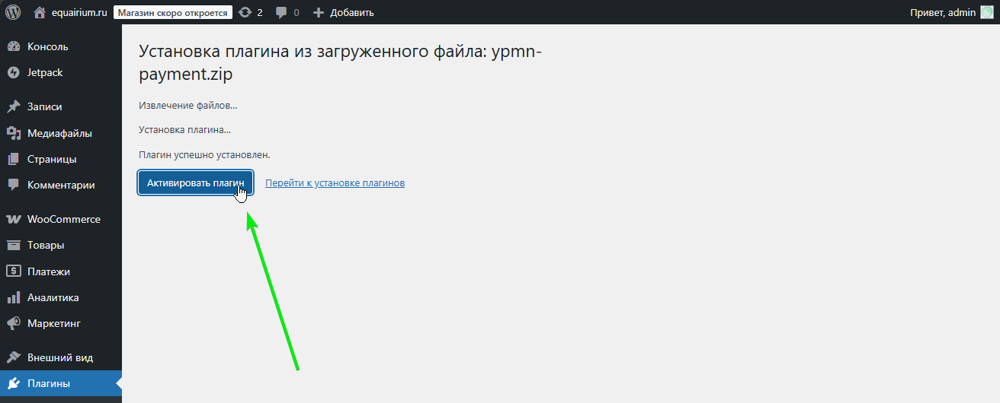
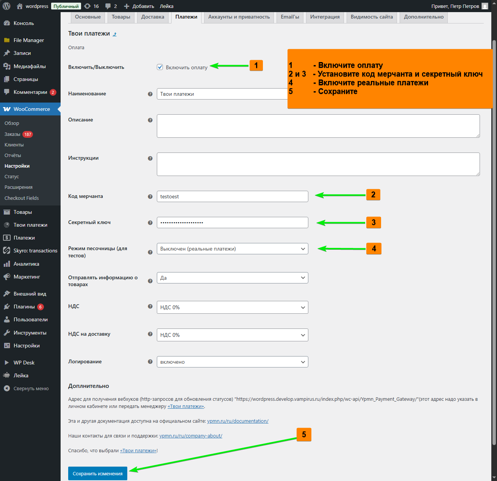
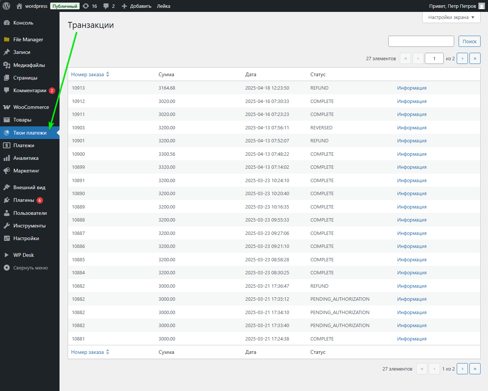

# «Твои платежи», плагин для CMS Wordpress WooCommerce

-------------
## Установка

[📥 Скачать ZIP-архив с плагином](dist/) | 
[▶️ Видео-инструкция на RuTube](https://rutube.ru/video/private/dcf8f4c7405bcd07adbaa9fb0c780bc9/?p=U01pLsYbffrOL0o08uqxFw)

1. Плагины - Добавить - Загрузить - Установить сейчас 

1. После загрузки: Активировать плагин 

1. После активации: WooCommerce - Настройки - Платежи - Твои Платежи

1. Проверить заполнение формы

1. После, если всё настроено правильно, можно смотреть транзакции здесь

-------------

## Ссылки
- [НКО «Твои Платежи»](https://YPMN.ru/)
- [Докуметация API](https://ypmn.ru/ru/documentation/)
- [Тестовые банковские карты](https://ypmn.ru/ru/documentation/#tag/testing)
- [Задать вопрос или сообщить о проблеме](https://ypmn.ru/ru/support/)

🟢 [«Твои Платежи»](https://YPMN.ru/ "Платёжная система для сайтов, платформ и приложений") -- финтех-составляющая для сайтов, платформ и приложений